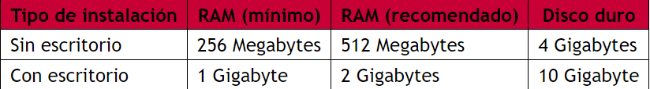

# maquinaDebian12
Preparación de una maquina con su configuración personalizada

# Requisitos para Preparar una Máquina Virtual con Debian 12

## 1. Requisitos Generales

Antes de comenzar, asegúrate de cumplir con los siguientes requisitos en tu sistema operativo base:

### 1.1 Hardware Recomendado
- **Procesador**: Intel/AMD con soporte de virtualización (habilitado en la BIOS/UEFI).
- **RAM**: Al menos 4 GB (recomendado 8 GB o más).
- **Almacenamiento**: Espacio disponible de al menos 25 GB para la máquina virtual.
- **Conexión a Internet**: Para descargar las ISOs y actualizar el sistema operativo.

## 2. Instalación de VirtualBox según el Sistema Operativo Host

### 2.1 Windows 11
1. Descarga la última versión de VirtualBox desde [https://www.virtualbox.org](https://www.virtualbox.org/wiki/Downloads).
2. Ejecuta el instalador y sigue los pasos predeterminados.
3. Instala el **Extension Pack** para soporte adicional de dispositivos USB, RDP, etc.
   - Descárgalo desde la misma página de VirtualBox.
   - Ve a `Archivo > Preferencias > Extensiones` y añade el **Extension Pack**.

### 2.2 macOS
1. Descarga VirtualBox para macOS desde [https://www.virtualbox.org/wiki/Downloads](https://www.virtualbox.org/wiki/Downloads).
2. Ejecuta el instalador y sigue las instrucciones.
3. **(Opcional)**: Instala el **Extension Pack** siguiendo los mismos pasos que en Windows.

### 2.3 Linux (Ubuntu/Debian)
1. Añade el repositorio oficial de VirtualBox:
   ```bash
   sudo apt update
   sudo apt install virtualbox
   sudo apt install virtualbox-ext-pack

## 3. Descarga de Debian 12 (64 bits)

1. Visita el sitio oficial de Debian: https://www.debian.org/index.es.html

2. **Descarga la ISO del DVD**:
   - Para una instalación completa sin requerir una conexión a Internet, elige la imagen **DVD**.
   - Haz clic en el enlace de descarga del primer DVD (DVD-1) que contiene los paquetes necesarios para la instalación básica.

   - **URL directa**: https://cdimage.debian.org/debian-cd/current/amd64/iso-dvd/
   
     
     

   - **Tamaño del archivo**: Alrededor de 4GB

---

Asegúrate de que la imagen ISO descargada esté completa antes de continuar con la creación de la máquina virtual.
