# maquinaDebian12
Preparación de una maquina con su configuración personalizada

# Requisitos para Preparar una Máquina Virtual con Debian 12

## 1. Requisitos Generales

Antes de comenzar, asegúrate de cumplir con los siguientes requisitos en tu sistema operativo base:

### 1.1 Hardware Recomendado
- **Procesador**: Intel/AMD con soporte de virtualización (habilitado en la BIOS/UEFI).
- **RAM**: Al menos 4 GB (recomendado 8 GB o más).
- **Almacenamiento**: Espacio disponible de al menos 25 GB para la máquina virtual.
- **Conexión a Internet**: Para descargar las ISOs y actualizar el sistema operativo.

## 2. Instalación de VirtualBox según el Sistema Operativo Host

### 2.1 Windows 11
1. Descarga la última versión de VirtualBox desde [https://www.virtualbox.org](https://www.virtualbox.org/wiki/Downloads).
2. Ejecuta el instalador y sigue los pasos predeterminados.
3. Instala el **Extension Pack** para soporte adicional de dispositivos USB, RDP, etc.
   - Descárgalo desde la misma página de VirtualBox.
   - Ve a `Archivo > Preferencias > Extensiones` y añade el **Extension Pack**.

### 2.2 macOS
1. Descarga VirtualBox para macOS desde [https://www.virtualbox.org/wiki/Downloads](https://www.virtualbox.org/wiki/Downloads).
2. Ejecuta el instalador y sigue las instrucciones.
3. **(Opcional)**: Instala el **Extension Pack** siguiendo los mismos pasos que en Windows.

### 2.3 Linux (Ubuntu/Debian)
1. Añade el repositorio oficial de VirtualBox:
   ```bash
   sudo apt update
   sudo apt install virtualbox
   sudo apt install virtualbox-ext-pack

## 3. Descarga de Debian 12 (64 bits)

1. Visita el sitio oficial de Debian: https://www.debian.org/index.es.html

2. **Descarga la ISO del DVD**:
   - Para una instalación completa sin requerir una conexión a Internet, elige la imagen **DVD**.
   - Haz clic en el enlace de descarga del primer DVD (DVD-1) que contiene los paquetes necesarios para la instalación básica.

   - **URL directa**: https://cdimage.debian.org/debian-cd/current/amd64/iso-dvd/
   
     
     

   - **Tamaño del archivo**: Alrededor de 4GB

---

Asegúrate de que la imagen ISO descargada esté completa antes de continuar con la creación de la máquina virtual.

## 4. Requisitos de Instalación de Debian 12


## 4.3 Requisitos de Recursos Asignados a la Máquina Virtual

Para optimizar el rendimiento durante la instalación de Debian 12, se han asignado los siguientes recursos a la máquina virtual:

- **RAM Asignada**: 5000 MB (5 GB)
  - **_Nota: Aunque 4500 MB (4.5 GB) es suficiente, se ha asignado 5000 MB para acelerar el proceso de instalación._**

- **Procesadores Asignados**: 4 núcleos
  - **_Nota: Aunque 2 núcleos (procesadores) son suficientes, se han asignado 4 núcleos para mejorar la velocidad de instalación._**
  - **_Nota: Si tu sistema tiene menos núcleos, asigna solo los disponibles._**
  
- **Almacenamiento Asignado**: En mi caso he asignado 40gb de almacenamiento dinámico.
  - **_Nota: El almacenamiento dinámico es una característica que permite que el tamaño del disco virtual crezca a medida que se necesite, hasta un tamaño máximo que se haya especificado al crear el disco._**
- **Adaptador de Red**: adaptador puente.
  - **_Nota: El adaptador de red en modo puente permite que la máquina virtual se comunique directamente con la red física, obteniendo una dirección IP de la misma subred que el host.(más tarde configuraremos la red en  el propio debian12)_**
---

Estos recursos ayudarán a garantizar que la instalación de Debian 12 se realice de manera eficiente y rápida.


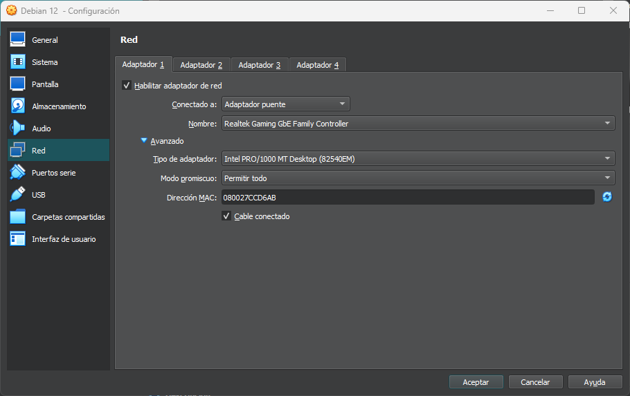

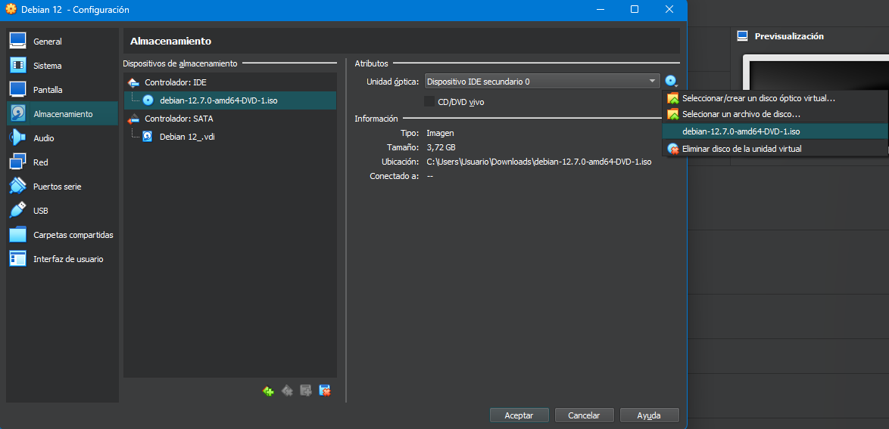

>ya tenemos la maquina virtual creada, ahora vamos a instalar el sistema operativo. ¡Ya podemos arrancar!


## 5. Instalación de Debian 12 en la Máquina Virtual
Durante la instalación de Debian, es importante prestar atención a la partición de disco. Asegúrate de realizar la instalación separando las siguientes particiones:

/ (Raíz): Esta es la partición principal donde se instalará el sistema operativo. Asegúrate de asignar un tamaño adecuado según tus necesidades.

/home: Esta partición es donde se almacenarán los archivos de usuario. Separarla permite una gestión más fácil de los datos personales y facilita las actualizaciones del sistema.

/swap: La partición de intercambio es útil para mejorar el rendimiento del sistema. Su tamaño puede ser igual al de la RAM o más, dependiendo del uso que le des al sistema.
               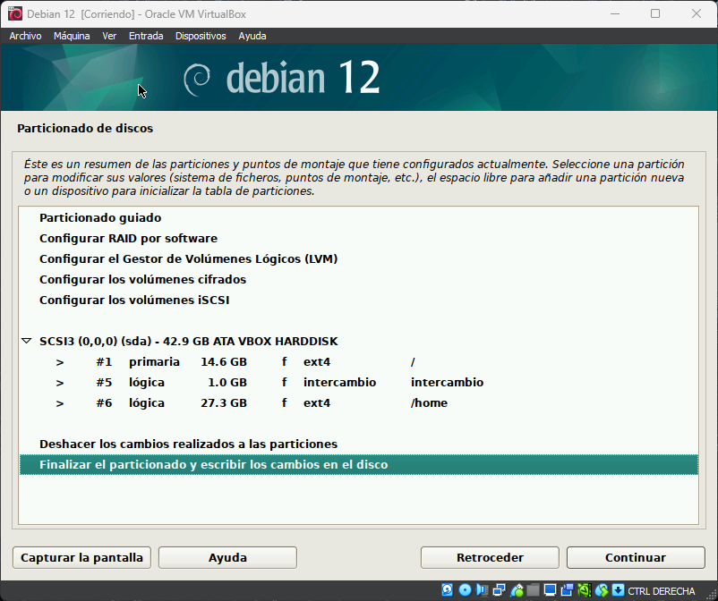


Para las demás opciones durante la instalación, puedes seguir el asistente y seleccionar "siguiente" según tus preferencias personales.

---

## 6. Instalacion guest-additions en Debian 12

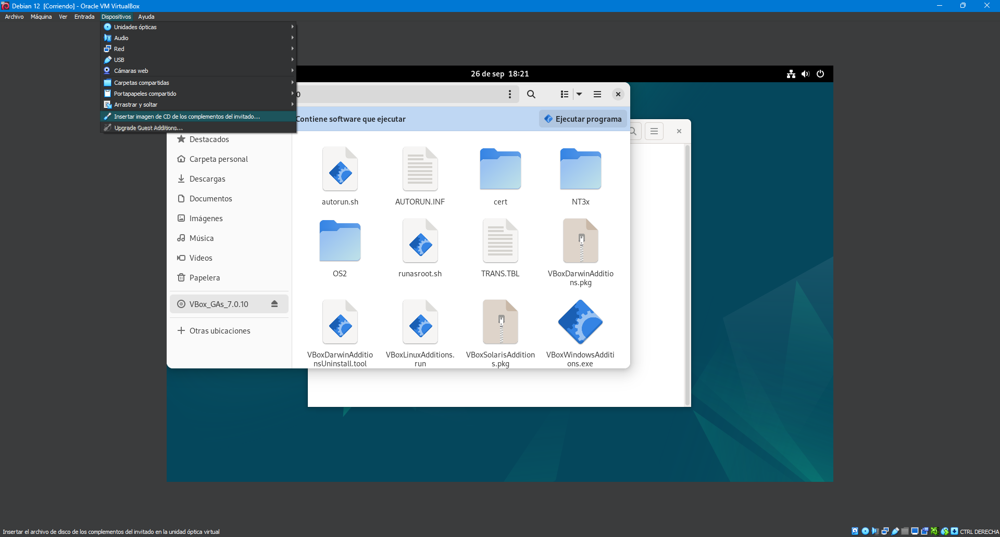
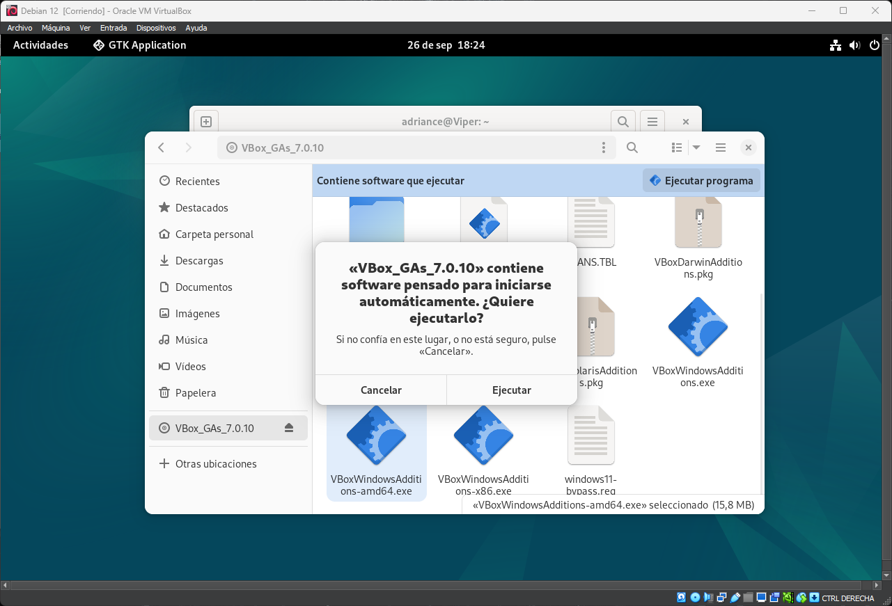
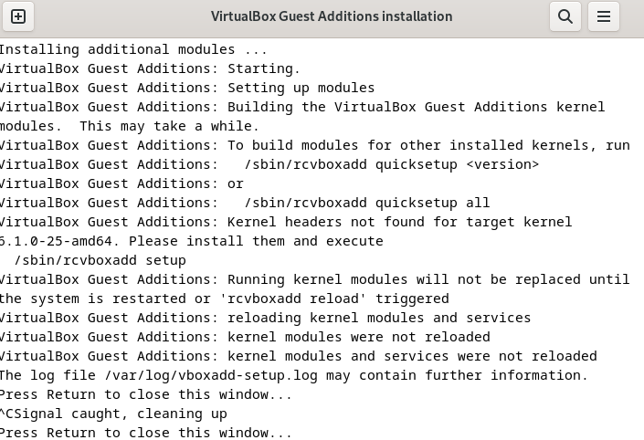

# 7. Configuración de Repositorios para Debian 12

Para configurar los repositorios en Debian 12, sigue estos pasos:

## 7.1. Abrir el archivo de configuración de repositorios

Abre una terminal y edita el archivo `/etc/apt/sources.list` usando un editor de texto como `nano` o `vim`. Por ejemplo:

```bash
su -

nano /etc/apt/sources.list
```


## 7.2. Configurar los repositorios

Agrega los siguientes repositorios al archivo `sources.list`:

```bash
deb http://deb.debian.org/debian/ bookworm main contrib non-free
deb-src http://deb.debian.org/debian/ bookworm main contrib non-free

deb http://deb.debian.org/debian-security/ bookworm-security main contrib non-free
deb-src http://deb.debian.org/debian-security/ bookworm-security main contrib non-free

deb http://deb.debian.org/debian/ bookworm-updates main contrib non-free
deb-src http://deb.debian.org/debian/ bookworm-updates main contrib non-free
```

**_NOTA: NO OLVIDES COMENTAR LA PRIMERA LINEA NADA MÁS ABRIR EL ARHIVO DE REPOSITORIOS, PUEDE DAR FALLO AL ACTUALIZAR_**

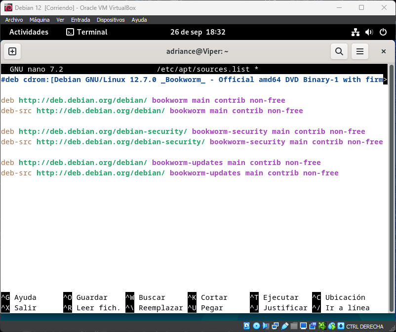

## 7.3. Guardar y Salir

Guarda los cambios y cierra el archivo
(CTRL + O y luego CTRL + X)

## 7.4. Actualizar la lista de paquetes

Actualiza la lista de paquetes de Debian 12 ejecutando el siguiente comando:

```bash
apt update && apt upgrade -y
```
**_NOTA: PUEDE SER QUE NECESITES SER ROOT, PARA ELLO EJECUTA EL COMANDO `su -` Y LUEGO EL COMANDO ANTERIOR_**

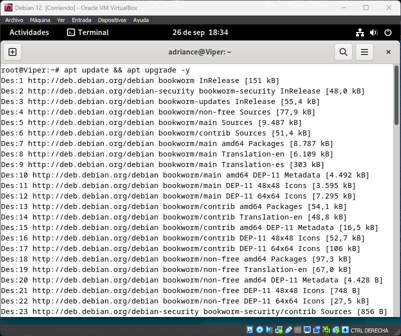

---

# 8. Configuración manual de la red (adaptador puente-red estática)

Para configurar la red en Debian 12, sigue estos pasos:

## 8.1. Editar el archivo de configuración de red

Averigua el nombre de la interfaz de red ejecutando el siguiente comando:

`ip a`

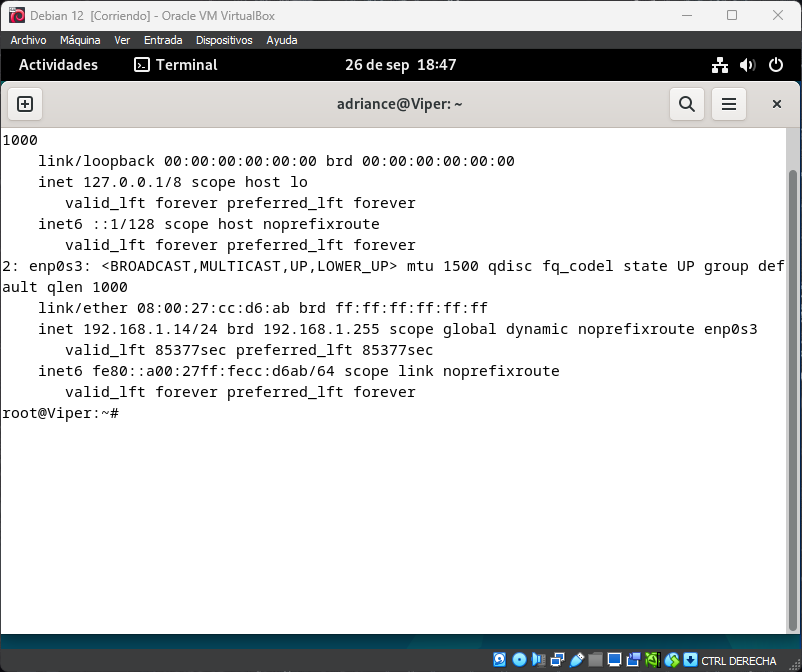
como root,

```bash
nano /etc/network/interfaces

```

## 8.2. Configurar la interfaz de red

Agrega las siguientes líneas al archivo `interfaces`:

```bash
auto enp0s3
iface enp0s3 inet static
address 192.168.1.100
netmask 255.255.255.0
gateway 192.168.1.1
dns-nameservers 8.8.8.8 8.8.4.4
```
**_NOTA: DAR UNA IP DEL RANGO DE TU RED, NO OLVIDAR LA MÁSCARA DE RED, LA PUERTA DE ENLACE Y LOS DNS_**


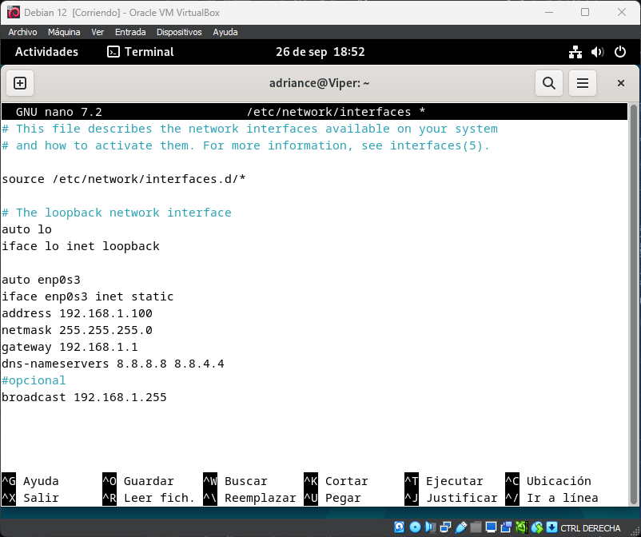

NOTA: guardar archivo y salir (CTRL + O y luego CTRL + X)

## 8.3. Reiniciar el servicio de red y comprobar la conexión


```bash
systemctl restart networking
```

ver si nos ha cambiado la ip con el comando `ip a`

```bash
ping google.com
```

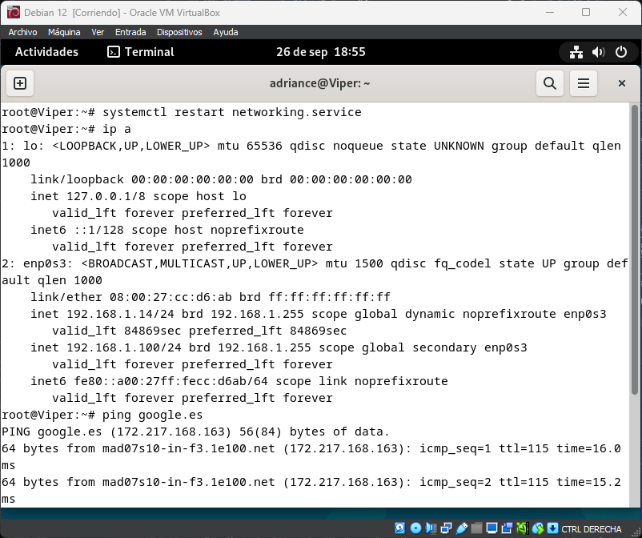


